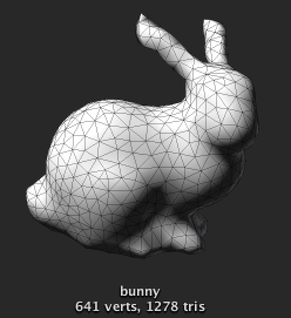

# Unity OFF
Import and export OFF (Object File Format) 3D models in Unity3D.

## OFF specification
* [Wikipedia - OFF (file format)](http://en.wikipedia.org/wiki/OFF_%28file_format%29)
* [http://www.geomview.org/docs/html/OFF.html](http://www.geomview.org/docs/html/OFF.html)

## Example OFF files
Some of well-known models in [The Stanford 3D Scanning Repository](http://graphics.stanford.edu/data/3Dscanrep/) can be downloaded form [here](http://www1.cs.columbia.edu/~cs4162/models/).

## Use cases
OFF files can be used in [CGAL (Computational Geometry Algorithms Library)](https://www.cgal.org/).

* [http://doc.cgal.org/latest/Polyhedron/group__PkgPolyhedronIOFunc.html](http://doc.cgal.org/latest/Polyhedron/group__PkgPolyhedronIOFunc.html)
